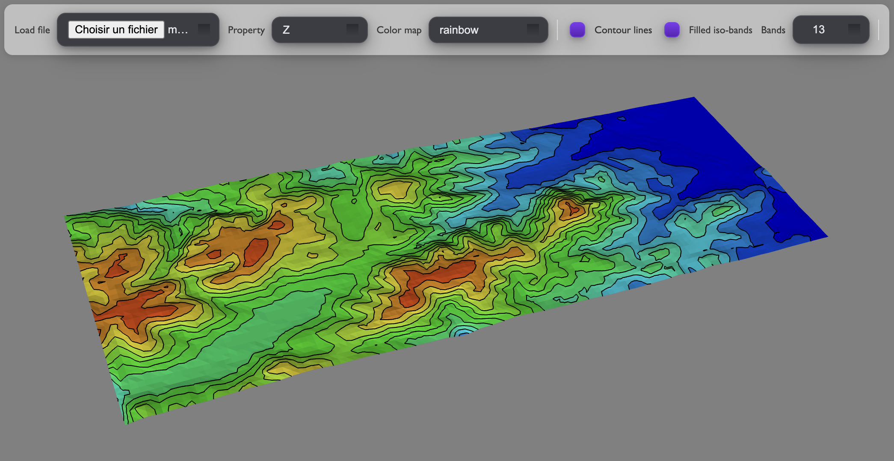

# 🪨 GOCAD TSurf loader with Iso-Contouring for VTK

<p align="center">
    
</p>

<center>

[Online demo](https://xaliphostes.github.io/vtk-gocad-loader/)

A GOCAD TSurf file is provided for testing. Download [it here](/models/mnt-tet-fault.ts)

</center>

A minimal TypeScript + [vtk.js](https://kitware.github.io/vtk-js/) application  
to load and visualize **GOCAD TSurf** files (`.ts`, `.tsurf`) in 3D, with:

- `vtkPolyDataFromGocadTSurf`
- shaded property coloring,
- optional **filled iso-contours** (`vtkIsoContoursFilled`),
- selectable color maps and scalar properties,

---

## 🧠 Key Code Snippets
```ts
// Toggle between shaded and iso-contour mode
if (bandsEnabled) {
    isoFilter.setScalarArrayName(selectedProp);
    isoFilter.setScalarRange([min, max]);
    isoFilter.setIsoValues(makeUniformIsoValues(min, max, bandCount));
    isoFilter.setLut(preset);
    isoActor.setVisibility(true);
    surfaceActor.setVisibility(false);
} else {
    isoActor.setVisibility(false);
    surfaceActor.setVisibility(true);
}
```

```ts
// Simple loader call
const loader = new ModelLoader();
const { polyData, properties } = await loader.loadFromFile(file);
surfaceMapper.setInputData(polyData);
renderer.resetCamera();
renderWindow.render();
```

## Author
[xaliphostes](https://github.com/xaliphostes)

## License
MIT
